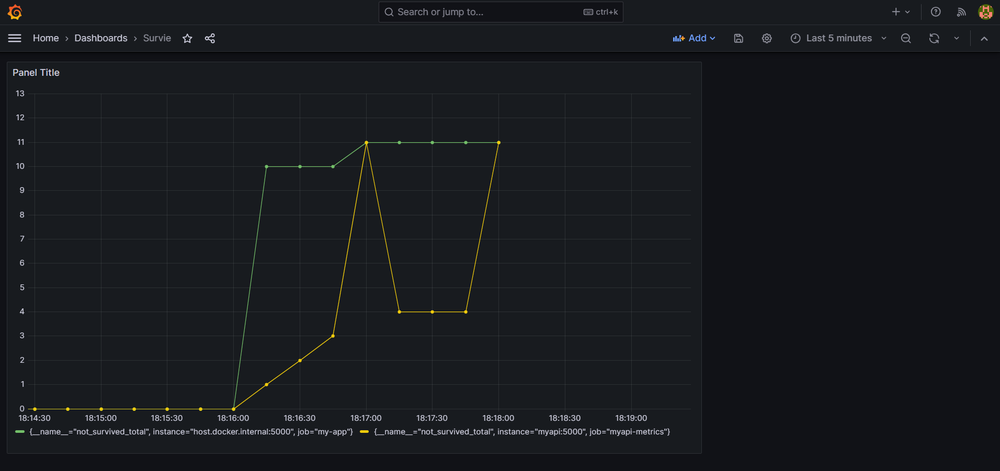

# Prédiction de crise cardiaque : API et supervision

Un modèle de prédiction mis en service, et surtout **surveillé**. Trois conteneurs : l'API qui sert le modèle, Prometheus qui collecte, Grafana qui affiche.

Le sujet du dépôt n'est pas le modèle — il est entraîné ailleurs et chargé depuis un fichier. Le sujet, c'est ce qui vient après : comment on expose une prédiction, et comment on sait qu'elle continue de bien se comporter une fois en production.



## L'architecture

| Composant | Rôle |
| --- | --- |
| **API** | Charge le modèle sérialisé, expose la prédiction, publie ses métriques |
| **Prometheus** | Interroge l'API à intervalle régulier et stocke les séries |
| **Grafana** | Branché sur Prometheus, affiche l'évolution |
| **Docker Compose** | Monte les trois ensemble |

## Ce qui est mesuré

Deux compteurs Prometheus, déclarés dans `metrics.py` : le nombre de prédictions « survie » et le nombre de prédictions « non-survie », exposés sur un point de terminaison ASGI dédié.

C'est volontairement simple, et c'est exactement le bon premier réflexe. Surveiller la **distribution des prédictions** est le moyen le plus direct de détecter une dérive : si le modèle se met soudain à prédire 90 % de non-survie alors qu'il tournait à 40 %, quelque chose a changé — les données d'entrée, un champ mal rempli en amont, ou la population elle-même. On le voit sans avoir besoin des vraies étiquettes, qui arrivent toujours trop tard.

## Contenu du dépôt

| Fichier | Rôle |
| --- | --- |
| `api_heart_attack_prediction.py` | L'API et le point de prédiction |
| `metrics.py` | Compteurs Prometheus |
| `heart_attack_prediction_model.joblib` | Modèle entraîné |
| `static/index.html` | Formulaire de saisie |
| `Dockerfile` | Image de l'API |
| `compose.yaml` | API, Prometheus et Grafana |
| `prometheus/prometheus.yml` | Cible de collecte |
| `grafana/datasource.yml` | Source de données pré-configurée |

## Mise en route

```bash
docker build -t heart_attack_prediction_api .
docker compose up -d
```

- L'API et son formulaire : `http://localhost:8000`
- Prometheus : `http://localhost:9090`
- Grafana : `http://localhost:3000`

La source de données Grafana étant provisionnée, il n'y a qu'à créer le tableau de bord sur les deux compteurs.

## Ce qui manquerait en production

Deux compteurs suffisent à voir une dérive grossière, pas à la caractériser. Il faudrait y ajouter la **latence** des prédictions, un **histogramme des scores** plutôt que le seul verdict binaire, et le **taux d'erreur** de l'API.

Et surtout, une surveillance des **données d'entrée** : c'est là que les dérives commencent, bien avant que la distribution des sorties ne bouge.
